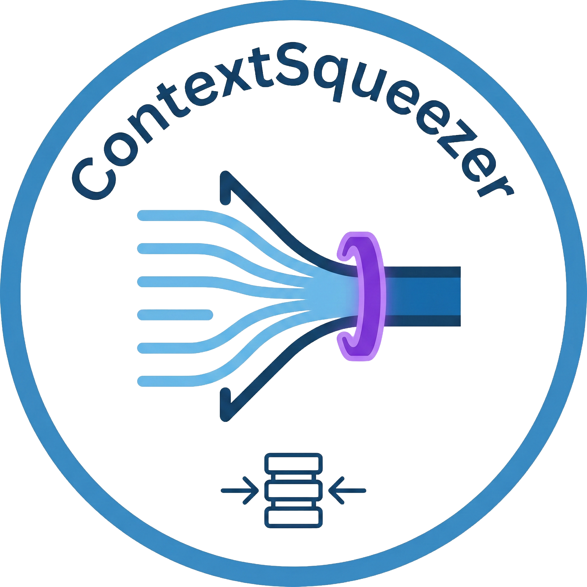

<div align="center">



# Context-Squeezer

**Deterministic document compression — squeeze tokens, not meaning.**

[](https://golang.org/)
[](https://isocpp.org/)
[](CHANGELOG.md)
[](LICENSE)
[](#build--test)

</div>

---

## What is Context-Squeezer?

**Context-Squeezer** is a fast, local CLI tool that compresses documents to fit within a given token budget — without rewriting or reordering your content. It is built with a Go CLI front-end and a high-performance C++ core.

It is designed for use-cases like feeding documents into LLM context windows, summarising large files, and batch document analysis — all without any network calls or external model dependencies.

### Key Guarantees

| Guarantee | Description |
|---|---|
| 🔒 **Deterministic** | Identical input + options always produce identical output |
| ✂️ **Drop-only** | No sentence reordering, no AI rewriting — only omission |
| ⚓ **Anchor-aware** | Preserved sections held unless budget truncation forces removal |
| 🎯 **Token-budget** | `--max-tokens` is strictly honoured with fallback truncation |
| 🌐 **Fully local** | Zero network calls, zero model dependencies |

---

## Supported Formats

<div align="center">

| Format | Extension |
|:---:|:---:|
| 📄 PDF | `.pdf` |
| 📝 Word | `.docx` |
| 🌐 HTML | `.html` |
| 📃 Plain Text / Markdown | `.txt`, `.md` |

</div>

---

## Quick Start

### Build

```bash
./scripts/build.sh
```

### Run

```bash
# Compress a PDF to 8 000 tokens, API profile
./build/bin/contextsqueeze --max-tokens 8000 --profile api doc.pdf

# Output as JSON
./build/bin/contextsqueeze --json page.html > out.json

# Show compression stats for a DOCX
./build/bin/contextsqueeze stats --source docx --max-tokens 2000 report.docx
```

> **Runtime linking (Linux)**
> ```bash
> export LD_LIBRARY_PATH="$(pwd)/build/native/lib:${LD_LIBRARY_PATH}"
> ```
>
> **Runtime linking (macOS)**
> ```bash
> export DYLD_LIBRARY_PATH="$(pwd)/build/native/lib:${DYLD_LIBRARY_PATH}"
> ```

---

## Output & Logging

| Stream | Content |
|---|---|
| `stdout` | Squeezed text (or JSON when `--json`) |
| `stderr` | Errors, warnings, stats, profiling |

**Flags:**

| Flag | Effect |
|---|---|
| `--quiet` | Suppress warnings |
| `--verbose` | Print per-stage timing |
| `CSQ_DEBUG=1` | Include stack traces on failure |

---

## JSON Output Schema

When using `--json`, the output contains these stable fields (schema locked at version `1`):

```json
{
  "schema_version": 1,
  "engine_version": "1.0.0",
  "build": { ... },
  "bytes_in": 0,
  "bytes_out": 0,
  "tokens_in": 0,
  "tokens_out": 0,
  "reduction_pct": 0.0,
  "aggressiveness": "",
  "profile": "",
  "budget_applied": true,
  "truncated": false,
  "source_type": "",
  "warnings": [],
  "text": "..."
}
```

> Token approximation formula: `approx_tokens = ceil(bytes / 4) + whitespace_word_count`

---

## Benchmarking

```bash
# Run with determinism checks (SHA-256 per run)
./build/bin/contextsqueeze bench --suite default --runs 5 --warmup 1 --aggr 0..9

# Benchmark a single file
./build/bin/contextsqueeze bench --file testdata/bench/large.txt --runs 10

# Benchmark an entire directory
./build/bin/contextsqueeze bench --dir testdata/bench --pattern "*.txt"
```

Bench checks deterministic SHA-256 digests per run and exits non-zero on mismatch.

---

## Profiling

```bash
# Capture CPU + heap profiles
./build/bin/contextsqueeze profile \
  --cpu out/cpu.pprof \
  --heap out/heap.pprof \
  --seconds 10 \
  testdata/bench/large.txt

# View interactive profile UI
go tool pprof -http=:0 out/cpu.pprof
```

See [`docs/perf.md`](docs/perf.md) for full benchmark and profiling workflows.

---

## Development

```bash
# Run tests
./scripts/test.sh

# Format code
./scripts/format.sh

# Verify no committed binaries
./scripts/verify_no_binaries.sh

# Run sanitizer gate
./scripts/sanitize.sh
```

---

## Release

Generate release artifacts locally (not committed to git):

```bash
./scripts/release.sh
```

Outputs are placed in `dist/`:

```
dist/
├── contextsqueeze_linux_amd64
├── contextsqueeze_darwin_amd64
├── contextsqueeze_darwin_arm64
├── SHA256SUMS
└── VERSION
```

---

## Exit Codes

| Code | Meaning |
|:---:|---|
| `0` | Success |
| `2` | Usage error |
| `3` | Input error |
| `4` | Parse error |
| `5` | Timeout |
| `6` | Internal error |

---

## Troubleshooting

- **Scanned / image-only PDFs** — OCR is not performed; text extraction will be empty.
- **DOCX files** — Must contain a valid `word/document.xml` entry.
- **Linux linking errors** — Set `LD_LIBRARY_PATH` as shown in the Quick Start above.
- **macOS linking errors** — Set `DYLD_LIBRARY_PATH` as shown in the Quick Start above.

---

<div align="center">

**Context-Squeezer** · v1.0.0 · MIT License

</div>
